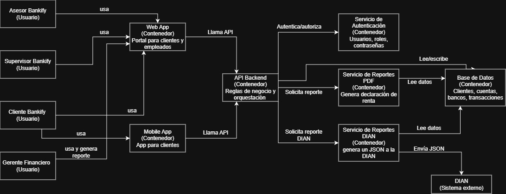
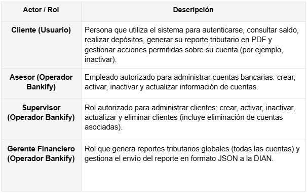
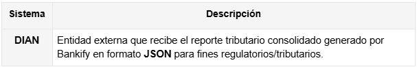

# 1. Sistema

   **• Nombre del sistema**

   Bankify – Sistema de Gestión Básica de Cuentas Bancarias

   **• Objetivo**

   El sistema tiene como objetivo centralizar y controlar la gestión básica de cuentas bancarias de los clientes de Bankify, permitiendo:

   Registrar cuentas: Cumpliendo reglas de negocio (validación de número y banco).

   Consultar saldo: De forma segura.

   Realizar depósitos: De manera controlada.

   Generar reportes tributarios: Para clientes en PDF.

   Generar y enviar reportes tributarios: A la DIAN en formato JSON.

# 2. Problema a resolver

   Bankify no cuenta con un sistema centralizado que permita administrar de forma segura y validada las cuentas bancarias y su información básica. Esto genera dificultades para:

   Registrar cuentas con reglas de negocio claras (10 dígitos, banco válido, etc.).

   Consultar el saldo de una cuenta por parte del cliente.

   Controlar depósitos y mantener trazabilidad básica.

   Generar reportes tributarios para clientes (PDF) y reportes regulatorios para la DIAN (JSON).

   Gestionar el ciclo de vida de clientes y cuentas (crear, activar, inactivar, actualizar y eliminar).

   Por lo tanto, se necesita un sistema que garantice validación, seguridad por roles, consistencia de datos y soporte para reportes tributarios.

# 3. Diagrama de Contexto

   **3.1 Diagrama**

**3.2 Actores**

**3.3 Sistemas externos**

# 4. Alcance del sistema
   **4.1 Dentro del sistema**

   Autenticación y autorización por roles: Con usuario y contraseña.

   Gestión de clientes: crear, activar, inactivar y actualizar información (por roles autorizados, por ejemplo un supervisor).

   Gestión de cuentas: crear, activar, inactivar y actualizar cuentas bancarias (asesor), e inactivar (cliente según permisos).

   Consulta de saldo: por parte del cliente.

   Depósitos controlados: a cuentas (por el propietario u otros usuarios).

   Generación de reporte tributario en PDF: para el cliente.

**4.2 Fuera del sistema**

No realiza transferencias interbancarias (ACH, PSE, SPEI, etc.) ni pagos a terceros (solo depósitos internos controlados).

No integra un “core bancario” real ni procesa transacciones bancarias reales con bancos externos (Bancolombia, Davivienda, etc.) en esta versión.

No gestiona productos financieros avanzados (créditos, inversiones, tarjetas, intereses, cuotas, etc.).

No incluye verificación KYC avanzada (biometría, validación documental, listas restrictivas) salvo que se agregue explícitamente.

No implementa MFA/2FA (autenticación multifactor) en el MVP, a menos que se defina como requisito adicional.

